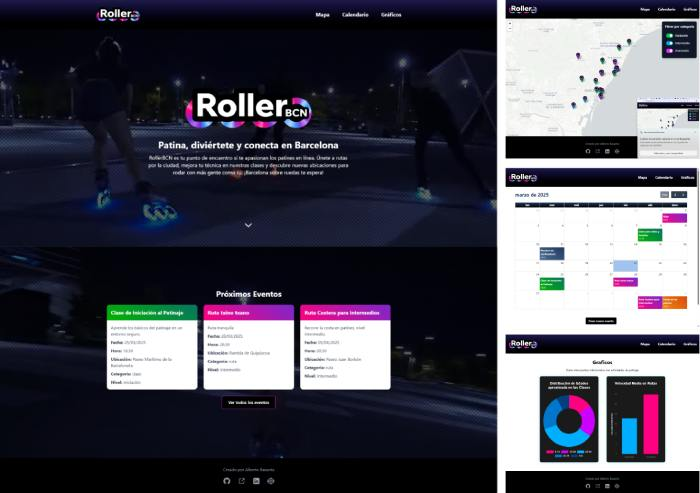

# RollerBCN

<p align="center">
  
</p>

## 📄 Descripción

**RollerBCN** es una aplicación web desarrollada con **Angular 19** dedicada al patinaje en Barcelona. La plataforma permite explorar ubicaciones para patinar en la ciudad, visualizar eventos en un calendario interactivo y analizar estadísticas mediante gráficos.

## ✨ Características

- **Mapa Interactivo con Leaflet**: Consulta ubicaciones para patinar con filtros por categoría.
- **Calendario con FullCalendar**: Visualiza y gestiona eventos de la comunidad.
- **CRUD de Eventos**: Crea, edita y elimina eventos almacenados en una API propia.
- **Gráficos con Chart.js**: Visualiza estadísticas de los eventos y ubicaciones.
- **API propia**: Los datos se obtienen de una API REST desarrollada en Node.js, Express y MongoDB. [Repositorio Backend-RollerBCN](https://github.com/basantades/Backend-RollerBCN)
- **Diseño moderno y responsive con Tailwind CSS**.
- **Despliegue en Vercel**: Disponible online en [https://rollerbcn.vercel.app](https://rollerbcn.vercel.app)

## 💻 Tecnologías Utilizadas

- **Angular CLI** versión 19.
- **Tailwind CSS** para el diseño y la maquetación.
- **Leaflet.js** para el mapa interactivo.
- **FullCalendar** para el calendario de eventos.
- **Chart.js** para la generación de gráficos.

## 📋 Requisitos

- **Node.js** y **npm** instalados en tu sistema. Descárgalos desde [nodejs.org](https://nodejs.org/).

## 🛠️ Instalación

### **✔️ Instalación paso a paso**

**1️⃣ Clona este repositorio:**
```bash
git clone https://github.com/basantades/RollerBCN.git
```

**2️⃣ Ingresa al directorio del proyecto:**
```bash
cd RollerBCN
```

**3️⃣ Instala las dependencias:**
```bash
npm install
```

## ▶️ Ejecución

Para iniciar la aplicación en desarrollo:
```bash
ng serve
```

Abre tu navegador y accede a `http://localhost:4200/`.

La API se encuentra desplegada en Railway:
[https://backend-rollerbcn-production.up.railway.app/](https://backend-rollerbcn-production.up.railway.app/)

Su código fuente está disponible en:
[https://github.com/basantades/Backend-RollerBCN](https://github.com/basantades/Backend-RollerBCN)

## 🤝 Contribuciones

Si deseas colaborar en el proyecto, sigue estos pasos:

1. Crea un **issue** para reportar errores o sugerir mejoras.
2. Envía un **pull request** con tus cambios.
3. Sigue las **buenas prácticas** de desarrollo y realiza pruebas antes de enviar tus cambios.

---

Este README proporciona una guía básica para configurar, utilizar y contribuir al proyecto **RollerBCN**.

